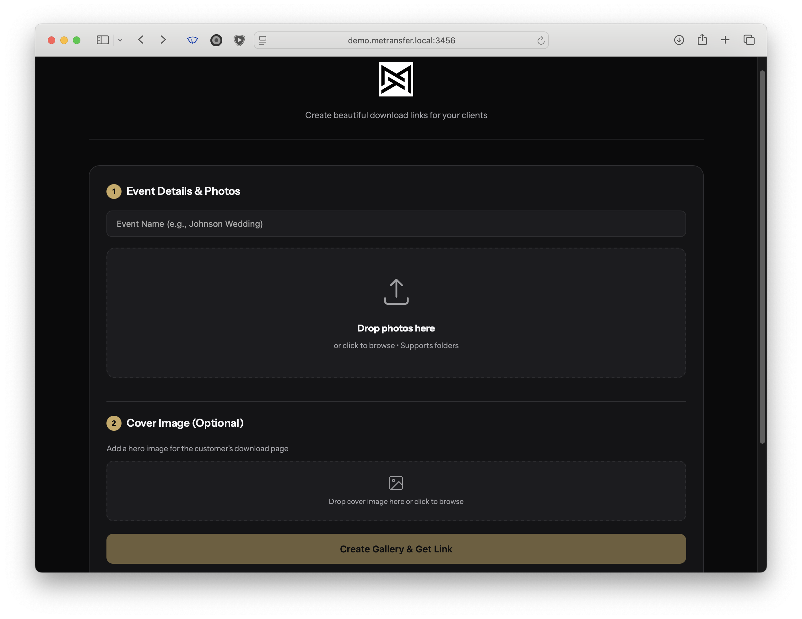
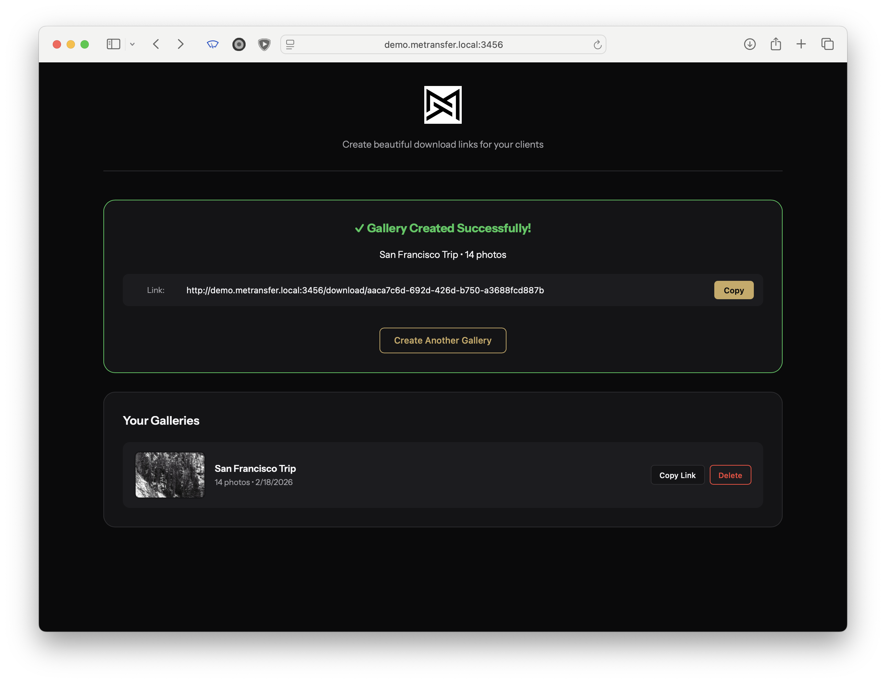

# MeTransfer

A self-hosted photo delivery platform for photographers. Upload photos, share a branded download link with your client — they get a beautiful gallery preview and a one-click ZIP download.

## Features

- **Drag & Drop Upload** — drop individual files or entire folders from your computer
- **Custom Backgrounds** — upload a hero image per gallery; stored as normalised JPEG
- **Photo Preview Page** — thumbnail grid with full-screen lightbox, keyboard/touch navigation, and individual photo download
- **ZIP Downloads** — all photos packaged into a single named download
- **Gallery Management** — rename galleries inline, set cover images, copy links, delete from the dashboard
- **Custom Logo** — upload your own logo from the dashboard; shown on both admin and client pages; revert to default anytime
- **Social Media Previews** — auto-generated OG images (1200×630) injected into share links
- **No Database Required** — file-based storage, simple to deploy and back up

---

## Screenshots

### Admin Dashboard


### Gallery Created


### Client Download Page


### Client Photo Preview


---

## Quick Start (Docker Compose)

This is the recommended installation method. You only need Docker installed.

### 1. Create a project directory

```bash
mkdir metransfer && cd metransfer
```

### 2. Create your `.env` file

```bash
cat > .env <<'EOF'
ADMIN_PASSWORD=your_secure_password_here
PORT=3000
MAX_UPLOAD_MB=200
MAX_BACKGROUND_MB=20
GALLERY_DIR=./data
TRUST_PROXY=1
EOF
```

### 3. Download docker-compose.yml

```bash
curl -O https://raw.githubusercontent.com/apadua/metransfer/main/docker-compose.yml
```

### 4. Start the container

```bash
docker compose up -d
```

MeTransfer is now running at `http://localhost:3000`. Gallery data is stored in `./data/` and persists across container restarts and upgrades.

### Updating

```bash
docker compose pull && docker compose up -d
```

---

## Configuration

All settings live in `.env`. Copy `.env.example` to get started — never commit `.env` to version control.

| Variable | Default | Description |
|----------|---------|-------------|
| `ADMIN_PASSWORD` | *(required)* | Password to access the admin dashboard |
| `PORT` | `3000` | TCP port the server listens on |
| `MAX_UPLOAD_MB` | `200` | Max size per photo file, in MB |
| `MAX_BACKGROUND_MB` | `20` | Max size for background images, in MB |
| `GALLERY_DIR` | `./data` | Host path mounted into the container as `/data`. Set to any writable path on your host (Docker only). |
| `TRUST_PROXY` | `0` | Set to `1` when running behind a reverse proxy (Nginx, Caddy, Traefik). Enables correct client IP detection for rate limiting and HTTPS detection. Docker Compose default: `1`. |

---

## Usage

1. **Open the Dashboard** — go to `http://localhost:3000`
2. **Log in** — enter your admin password
3. **Enter an Event Name** — e.g. "Johnson Wedding" or "Senior Photos — Sarah"
4. **Upload Photos** — drag and drop files or entire folders onto the upload zone
5. **Add a Background** *(optional)* — upload a hero image shown on the client page
6. **Create Gallery** — click "Create Gallery & Get Link"
7. **Share** — copy the generated link and send it to your client

### What your client sees

When your client opens the link they see:
- Your custom background image (if uploaded)
- The event name as the page title
- A **"Browse Photos"** button that opens a thumbnail grid with a full-screen lightbox and individual download
- A **"Download All"** button — all photos arrive as one ZIP file

---

## Deployment

### Behind Nginx (free SSL with Let's Encrypt)

Install Nginx and Certbot:

```bash
sudo apt install -y nginx certbot python3-certbot-nginx
```

Create a site config:

```bash
sudo nano /etc/nginx/sites-available/metransfer
```

Paste:

```nginx
server {
    listen 80;
    server_name photos.yourdomain.com;

    location / {
        proxy_pass http://localhost:3000;
        proxy_http_version 1.1;
        proxy_set_header Upgrade $http_upgrade;
        proxy_set_header Connection 'upgrade';
        proxy_set_header Host $host;
        proxy_set_header X-Real-IP $remote_addr;
        proxy_set_header X-Forwarded-For $proxy_add_x_forwarded_for;
        proxy_set_header X-Forwarded-Proto $scheme;
        proxy_cache_bypass $http_upgrade;

        # Required for large photo uploads
        client_max_body_size 500M;
    }
}
```

Enable and reload:

```bash
sudo ln -s /etc/nginx/sites-available/metransfer /etc/nginx/sites-enabled/
sudo nginx -t
sudo systemctl reload nginx
```

Get a free SSL certificate:

```bash
sudo certbot --nginx -d photos.yourdomain.com
```

Certbot will automatically renew the certificate. MeTransfer is now accessible at `https://photos.yourdomain.com`.

Make sure `TRUST_PROXY=1` is set in your `.env` so that rate limiting and HTTPS detection use the real client IP and protocol rather than the proxy's.

---

## Manual Installation (bare-metal, no Docker)

### 1. Install Node.js

The recommended approach is [nvm](https://github.com/nvm-sh/nvm):

```bash
curl -o- https://raw.githubusercontent.com/nvm-sh/nvm/v0.39.7/install.sh | bash
source ~/.bashrc          # or ~/.zshrc if you use zsh
nvm install 20
nvm use 20
node -v                   # should print v20.x.x
```

Alternatively, using apt (Ubuntu/Debian):

```bash
curl -fsSL https://deb.nodesource.com/setup_20.x | sudo -E bash -
sudo apt-get install -y nodejs
node -v
```

### 2. Clone the repository

`/opt` is the conventional location for self-contained applications on a server:

```bash
cd /opt
sudo git clone https://github.com/apadua/metransfer.git
sudo chown -R $USER:$USER /opt/metransfer
cd metransfer
```

### 3. Install dependencies

```bash
npm install
```

### 4. Configure environment

```bash
cp .env.example .env
nano .env
```

Set at minimum:

```
ADMIN_PASSWORD=your_secure_password_here
```

Save and exit (`Ctrl+O`, `Enter`, `Ctrl+X` in nano).

### 5. Start the server

```bash
npm start
```

The server starts at `http://localhost:3000`.

### Keep it running with PM2

PM2 keeps the process alive across reboots:

```bash
npm install -g pm2
pm2 start server.js --name metransfer
pm2 save
pm2 startup   # follow the printed command
```

To check logs:

```bash
pm2 logs metransfer
```

---

## File Structure

```
metransfer/
├── server.js           # Express server — all routes and middleware
├── package.json        # Dependencies
├── Dockerfile
├── docker-compose.yml
├── .env                # Your config (gitignored — never committed)
├── .env.example        # Template for new installs
├── public/
│   ├── admin.html      # Photographer dashboard
│   ├── customer.html   # Client download page
│   ├── preview.html    # Photo browser — thumbnail grid + lightbox
│   └── logo.svg        # Default logo (replaced at runtime by a custom upload)
└── data/               # Runtime data (Docker volume mount)
    ├── uploads/        # Gallery photos, organised by gallery ID
    ├── backgrounds/    # Background images, one per gallery (JPEG)
    ├── thumbnails/     # 400px preview thumbnails, generated automatically
    ├── og-cache/       # 1200×630 OG images, generated on first share
    ├── logo.*          # Custom logo if uploaded (overrides logo.svg)
    └── galleries.json  # Gallery metadata
```

`data/` and its contents are gitignored — they contain user data, not source code.

---

## API Reference

| Method | Endpoint | Auth | Description |
|--------|----------|------|-------------|
| `GET` | `/` | — | Admin dashboard |
| `GET` | `/download/:id` | — | Client download page (with OG meta tags) |
| `GET` | `/preview/:id` | — | Photo preview page (with OG meta tags) |
| `POST` | `/api/auth/verify` | — | Verify admin password |
| `POST` | `/api/gallery/create` | ✓ | Create gallery and upload photos |
| `POST` | `/api/gallery/:id/upload` | ✓ | Add photos to existing gallery |
| `POST` | `/api/gallery/:id/background` | ✓ | Upload/replace background image |
| `POST` | `/api/gallery/:id/rename` | ✓ | Rename a gallery |
| `GET` | `/api/gallery/:id/info` | — | Gallery metadata |
| `GET` | `/api/gallery/:id/photos` | — | List photos with URLs (used by preview page) |
| `GET` | `/api/gallery/:id/photo/:filename` | — | Serve photo; add `?thumb=1` for 400px thumbnail |
| `GET` | `/api/gallery/:id/download` | — | Download all photos as ZIP |
| `GET` | `/api/gallery/:id/download/:filename` | — | Download a single photo |
| `GET` | `/api/gallery/:id/background` | — | Serve background image |
| `GET` | `/api/gallery/:id/og-image` | — | Serve/generate 1200×630 OG image |
| `GET` | `/api/galleries` | ✓ | List all galleries |
| `DELETE` | `/api/gallery/:id` | ✓ | Delete a gallery |

Authenticated endpoints require the `X-Admin-Password` header.

---

## Tips

- **Branding** — use a photo from the same session as the background for a cohesive look
- **File names** — rename files on your camera before uploading; the original names are preserved
- **Disk space** — delete galleries once clients have downloaded; `uploads/` can grow large
- **Link expiry** — there is no automatic expiry; delete a gallery from the dashboard when done

---

## Troubleshooting

### Upload fails for large batches

Increase the Node.js heap size:

```bash
NODE_OPTIONS="--max-old-space-size=4096" npm start
```

### Nginx returns 413 Request Entity Too Large

Add or increase `client_max_body_size` in your Nginx config:

```nginx
client_max_body_size 500M;
```

Then reload Nginx: `sudo systemctl reload nginx`

### Downloads time out on very large galleries

- Split the session into multiple galleries
- Increase the proxy timeout in Nginx: `proxy_read_timeout 300;`

### Server won't start — "ADMIN_PASSWORD is not set"

Make sure `.env` exists and contains `ADMIN_PASSWORD`. Run:

```bash
cp .env.example .env
nano .env
```

---

## License

MIT — free to use and modify for your photography business.
